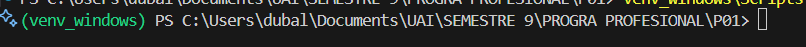

# 🚀 Sistema de Gestión de Empresas - Frontend

<div align="center">


Una aplicación web moderna para la gestión y visualización de datos empresariales con grafos interactivos de relaciones entre fundadores y empresas.

[Ver Demo](#) · [Reportar Bug](https://github.com/Dubalio/P01_frontend/issues) · [Solicitar Feature](https://github.com/Dubalio/P01_frontend/issues)

</div>

---

## 📋 Tabla de Contenidos

- [Características](#-características)
- [Tech Stack](#️-tech-stack)
- [Instalación](#-instalación)
- [Configuración](#️-configuración)
- [Uso](#-uso)
- [Estructura del Proyecto](#-estructura-del-proyecto)
- [Screenshots](#-screenshots)
- [Seguridad](#-seguridad)
- [Contribuir](#-contribuir)

---

## ✨ Características

- 🔐 **Sistema de Autenticación**: Login/Register con roles (Estudiante/Profesor)
- 🔍 **Búsqueda Avanzada**: Filtros por razón social, fundadores o fecha
- 📊 **Visualización de Grafos**: Grafos interactivos D3.js con física de nodos
- 🎨 **Modo Oscuro/Claro**: Toggle dinámico con persistencia
- 📥 **Exportación de Datos**: Exporta resultados en múltiples formatos
- 📱 **Diseño Responsive**: Optimizado para móviles, tablets y desktop
- ⚡ **Carga Dinámica**: Procesamiento y actualización de datos en tiempo real
- 🔄 **Actualización Automática**: Refresh tokens para sesiones persistentes

---

## 🛠️ Tech Stack

### **Frontend Framework**
- **React 18.2.0** - Librería UI principal
- **React DOM 18.2.0** - Renderizado del DOM
- **React Router DOM 7.6.0** - Enrutamiento SPA

### **Visualización de Datos**
- **D3.js 7.9.0** - Grafos interactivos con simulación de fuerzas

### **Build Tools**
- **Vite 5.0.0** - Build tool ultra-rápido
- **@vitejs/plugin-react 4.0.0** - Plugin oficial de React para Vite

### **Estilos**
- **CSS3 Vanilla** - Sin frameworks, 100% custom
- **Flexbox** - Layouts responsivos
- **CSS Variables** - Theming dinámico

### **API & Networking**
- **Fetch API** - Peticiones HTTP nativas
- **Credentials Management** - Cookies HTTP-only para seguridad

---

## 📦 Instalación

### Prerrequisitos

- Node.js >= 16.x
- npm o yarn
- Backend API corriendo en `http://localhost:5000` (ver repositorio backend)

### Pasos de Instalación

1. **Clonar el repositorio**
```bash
git clone https://github.com/Dubalio/P01_frontend.git
cd P01_frontend
```

2. **Instalar dependencias**
```bash
npm install
# o
yarn install
```

3. **Configurar variables de entorno**
```bash
# Copiar el archivo de ejemplo
cp .env.example .env

# Editar .env con tus configuraciones
```

4. **Iniciar el servidor de desarrollo**
```bash
npm run dev
# o
yarn dev
```

5. **Abrir en el navegador**
```
http://localhost:5173
```

---

## ⚙️ Configuración

### Variables de Entorno

Crea un archivo `.env` en la raíz del proyecto:

```env
# API Configuration
VITE_API_BASE_URL=http://localhost:5000/api/auth
VITE_DOCS_API_URL=http://localhost:5000/api/documents
```

### Build para Producción

```bash
npm run build
# o
yarn build
```

Los archivos compilados estarán en la carpeta `dist/`.

### Preview de Producción

```bash
npm run preview
# o
yarn preview
```

---

## 🎯 Uso

### 1. **Registro e Inicio de Sesión**
- Regístrate como Estudiante o Profesor
- Inicia sesión con tus credenciales

### 2. **Búsqueda de Empresas**
- Usa la barra de búsqueda con filtros personalizados
- Filtra por: Todos, Razón Social, Fundadores o Fecha

### 3. **Visualización del Grafo**
- Haz clic en "Ver Grafo de Relaciones"
- Interactúa con los nodos (drag & drop, zoom, pan)
- Click en nodos para ver detalles

### 4. **Procesamiento de Datos** (Solo Admin)
- Procesa documentos desde el backend
- Actualiza los datos en tiempo real

### 5. **Exportación**
- Selecciona formato de exportación
- Descarga los resultados filtrados

---

## 📁 Estructura del Proyecto

```
P01_frontend/
├── src/
│   ├── components/
│   │   ├── Dashboard.jsx       # Panel principal
│   │   ├── Login.jsx           # Componente de login
│   │   ├── Register.jsx        # Componente de registro
│   │   ├── Header.jsx          # Header con toggle modo oscuro
│   │   ├── SearchBar.jsx       # Barra de búsqueda
│   │   ├── ResultsList.jsx     # Lista de resultados
│   │   ├── Graphpage.jsx       # Visualización D3.js
│   │   ├── ExportOptions.jsx   # Opciones de exportación
│   │   ├── ProcessDataButton.jsx # Procesamiento de datos
│   │   ├── Dashboard.css       # Estilos del dashboard
│   │   └── Login.css           # Estilos del login
│   ├── services/
│   │   └── api.js              # Servicios API (fetch wrapper)
│   ├── App.jsx                 # Componente raíz
│   ├── main.jsx                # Entry point
│   └── index.css               # Estilos globales
├── .env.example                # Ejemplo de variables de entorno
├── .gitignore                  # Archivos ignorados por Git
├── index.html                  # HTML principal
├── package.json                # Dependencias del proyecto
├── vite.config.js              # Configuración de Vite
└── README.md                   # Este archivo
```

---

## 📸 Screenshots

### Dashboard Principal


### Grafo Interactivo D3.js
*Visualización de relaciones entre empresas y fundadores con física de nodos*

### Modo Oscuro
*Toggle dinámico entre tema claro y oscuro*

---

## 🔒 Seguridad

### ✅ Medidas Implementadas

- **Variables de Entorno**: `.env` está en `.gitignore` y NO se sube al repositorio
- **HTTP-only Cookies**: Los tokens se manejan vía cookies seguras
- **Credentials Include**: CORS configurado correctamente
- **Refresh Tokens**: Sistema automático de renovación de sesión
- **Error Handling**: Manejo robusto de errores de autenticación

### ⚠️ Consideraciones para Producción

1. **HTTPS Obligatorio**: Usar HTTPS en producción
2. **CORS Restrictivo**: Configurar dominios permitidos específicos
3. **Rate Limiting**: Implementar en el backend
4. **CSP Headers**: Content Security Policy
5. **Environment Variables**: Usar servicios como Vercel/Netlify para manejar secrets

### 🔐 Variables Sensibles

**NUNCA** subas al repositorio:
- Archivos `.env`
- Tokens de API
- Credenciales de base de datos
- Keys privadas

Usa `.env.example` como plantilla sin valores reales.

---

## 🎨 Características de Diseño Responsive

El proyecto usa técnicas modernas de CSS para adaptarse a todos los dispositivos:

- **Flexbox Layouts** con `flex-wrap: wrap`
- **Unidades Relativas** (rem/em) en lugar de píxeles fijos
- **Max-width + Auto Margins** para centrado responsivo
- **Gap y Padding Proporcionales** que se ajustan automáticamente
- **Media Queries** implícitas mediante Flexbox

---

## 🤝 Contribuir

Las contribuciones son bienvenidas. Para cambios importantes:

1. Fork el proyecto
2. Crea una rama para tu feature (`git checkout -b feature/AmazingFeature`)
3. Commit tus cambios (`git commit -m 'Add: nueva característica'`)
4. Push a la rama (`git push origin feature/AmazingFeature`)
5. Abre un Pull Request

---

## 📝 Licencia

Este proyecto es de código abierto y está disponible bajo la licencia MIT.

---

## 👨‍💻 Autor

**Dubalio**

- GitHub: [@Dubalio](https://github.com/Dubalio)

---

## 🙏 Agradecimientos

- [React](https://react.dev/) - Framework principal
- [D3.js](https://d3js.org/) - Visualización de grafos
- [Vite](https://vitejs.dev/) - Build tool increíble
- [React Router](https://reactrouter.com/) - Enrutamiento SPA

---

<div align="center">
  <sub>Construido con ❤️ usando React y D3.js</sub>
</div>
